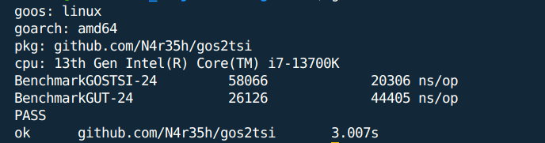

# gos2tsi

**gos2tsi** is a lightweight, reflection-free Go library designed to convert Go structs into TypeScript interfaces. It leverages the `golang.org/x/tools/go/packages` package for static code analysis, ensuring efficient and accurate TypeScript interface generation without the overhead of runtime reflection.

about 50% faster when compared to an alternative


### Supports

- All primitives types
- Generics
- Slices
- Multi Dimentional Slices
- Structs
- Inline Structs
- Struct Slices
- Embedded structs
- Custom TS type specification (via struct tag)
- Comprenensive map support (w/ multilevel nesting)
- omitempty and optional flags to generate TS Interfaces with optional fields

## Example

Example usage

```go
c := gos2tsi.New()
ps := c.ParseStruct(structs.MasterStruct[structs.SimpleStruct, []string]{})
op := c.GetStructAsInterfaceString(ps)
fmt.Println(op)
```

Example structs

```go
type SimpleStruct struct {
	Test string `json:"test"`
}
type EmbedableStruct struct {
	ID uint `json:"id"`
}
// First comment line for MasterStruct
// Secound comment line for MasterStruct
/* MasterStruct has all if not most of the features supported by the parser */
type MasterStruct[T any, U any] struct {
	EmbedableStruct

	FieldWOJSONTag string
	HiddenField    string `json:"-"`

	StructSlice []SimpleStruct

	Generic  []T `json:"generic"`
	Generic2 []U `json:"generic2"`

	CustomeTSType time.Time `json:"custom_ts_type" ts_type:"string"`

	ArrayString []string `json:"array_string"`

	SSMap                    map[string]string                       `json:"ssmap"`
	ArrayOfMaps              []map[string]string                     `json:"array_of_maps"`
	MapOfMaps                map[string]map[string]string            `json:"map_of_maps"`
	MapStringInt             map[string]int                          `json:"map_string_int"`
	MapStringFloat           map[string]float64                      `json:"map_string_float"`
	MapStringInterface       map[string]interface{}                  `json:"map_string_interface"`
	MapStringAny             map[string]any                          `json:"map_string_any"`
	MapStringPrimitiveStruct map[string]SimpleStruct                 `json:"map_string_primitive_struct"`
	MapOfMapsOfMaps          map[string]map[string]map[string]string `json:"map_of_maps_of_maps"`
	MapOfArrayOfMaps         map[string][]map[string]string          `json:"map_of_arrays_of_maps"`

	String3DSlice [][]string
	Struct3DSlice [][]SimpleStruct

	RequiredField  string `json:"required_field"`
	OmitEmptyField string `json:"omitempty_field,omitempty"`
	OptionalField  string `json:"optional_field" optional:"true"`

	PointerFlag *bool `json:"pointer_flag"`
}
```

Example output

```ts
export interface EmbedableStruct {
  id: number;
}
export interface SimpleStruct {
  test: string;
}
/**
First comment line for MasterStruct
Secound comment line for MasterStruct
MasterStruct has all if not most of the features supported by the parser
*/
export interface MasterStruct<T, U> {
  id: number;
  FieldWOJSONTag: string;
  StructSlice: SimpleStruct[];
  generic: T[];
  generic2: U[];
  custom_ts_type: string;
  array_string: string[];
  ssmap: { [key: string]: string };
  array_of_maps: { [key: string]: string }[];
  map_of_maps: { [key: string]: { [key: string]: string } };
  map_string_int: { [key: string]: number };
  map_string_float: { [key: string]: number };
  map_string_interface: { [key: string]: any };
  map_string_any: { [key: string]: any };
  map_string_primitive_struct: SimpleStruct;
  map_of_maps_of_maps: {
    [key: string]: { [key: string]: { [key: string]: string } };
  };
  map_of_arrays_of_maps: { [key: string]: { [key: string]: string }[] };
  String3DSlice: string[][];
  Struct3DSlice: SimpleStruct[][];
  required_field: string;
  omitempty_field?: string;
  optional_field?: string;
  pointer_flag: boolean;
}
```

## Projects that use gos2tsi

`gos2tsi` is utilized in the [wfiber](https://github.com/N4r35h/wfiber) project, a wrapper over the Go Fiber web framework. In wfiber, gos2tsi aids in generating TypeScript clients for API endpoints by converting Go structs used in route definitions to TypeScript interfaces, ensuring type safety across the backend and frontend.
